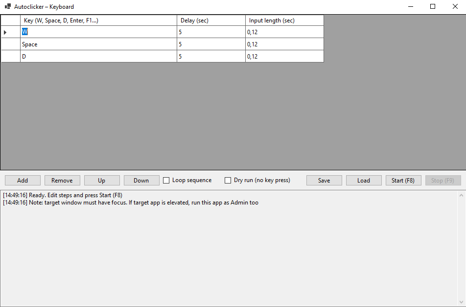

# Autoclicker – Keyboard

🚀 A simple and lightweight Windows tool to automate **keyboard key sequences** with custom delays and hold durations.
Perfect for repetitive tasks, testing or gaming.

---

---

## ✨ Features

- Create and edit sequences of key presses (W, Space, D, Enter, F1, etc.)
- Set delay and hold time for each key
- Start/stop sequences with global hotkeys:
  - **F8** → Start
  - **F9** → Stop
- Loop mode for repeating sequences
- Dry Run mode (test without sending actual key presses)
- Save and load sequences as JSON files

---

## ⚙️ Requirements

- Windows 10/11

## 📥 Installation

1. Go to the [Releases](../../releases) page
2. Download the latest `Autoclicker.zip` from **Assets**
3. Extract the archive
4. Run `Autoclicker.exe` or just download it

---

## 🚀 Usage

1. Add steps to the sequence (key, delay, hold time)
2. Use **F8** to start, **F9** to stop
3. (Optional) Enable **Loop** or **Dry Run**
4. Save/load sequences for future use

ℹ️ **Note:** If the target application runs as Administrator, Autoclicker must also be launched as Administrator.

---

## 📝 License

This project is licensed under the [Apache License 2.0](LICENSE).
Attribution is required if you use or distribute this project.

---

## 💬 Support

If you find bugs or have feature requests, please open an [Issue](../../issues).
